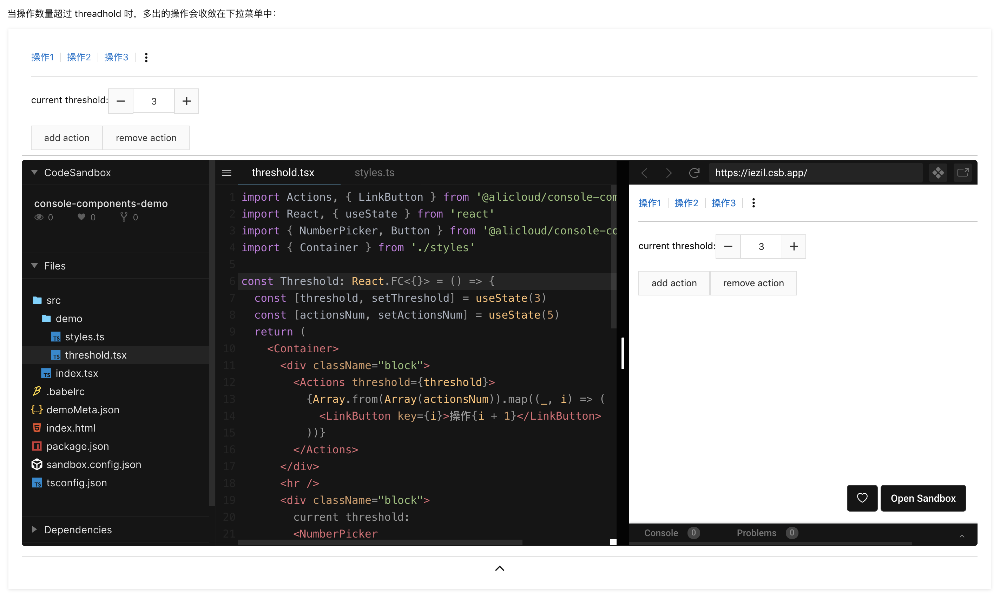

# @alicloud/console-components-lib-publisher

`@alicloud/console-components-lib-publisher`是 console-components 提供的开发者工具之一。
它提供了脚本工具，来辅助物料开发、协作：

- cc-extract-api 它做了以下 3 件事情：
  - 使用[api-extractor](https://api-extractor.com/pages/overview/intro/)，读取`lib/index.d.ts`（即`tsc`的输出），提取 ts 代码中的类型、注释信息。输出到`cc-dev-out/api-extractor/`目录。
  - 然后，`dev-kit/api-documenter`会将上述输出信息加工成 json 数据，作为 API 文档的数据。输出到`cc-dev-out/api-json/`目录。因此，业务组件的 API 文档由源码转化而成，而不是人工维护，避免文档腐化
  - 以`lib/index.d.ts`为入口，将`.d.ts`声明文件打包（类似于 webpack 打包 js 模块），输出到`cc-dev-out/index.d.ts`，在此过程中，被声明为`@internal`和`@alpha`的 ts 类型、接口成员会被过滤掉。你可以利用这一点来避免不稳定的 ts 接口暴露给用户，提高封装性。详见[api-extractor 文档](https://api-extractor.com/pages/overview/demo_rollup/)。
- cc-build-doc 将 markdown 文档构建成一个 js bundle。
  - 构建成 js bundle 的好处是便于分发和扩展。各种基于 markdown 的扩展（demo 嵌入、ts Interface 渲染）在构建阶段就已经被处理完毕，文档站点无需关注文档功能的编译和实现，**文档站点可以将一篇文档当做一个普通 React 组件来加载、渲染**。未来我们向 markdown 语法加入更多扩展的时候，文档站点没有感知。
  - 相对路径引入的本地图片会被压缩、内联成 data-url，以保证最大的便携性。
- cc-doc-local-dev 本地开发、预览。
  - 依然已经可以将 markdown 文档构建成一个 js bundle，自然也就很容易实现本地开发模式（使用`webpack-dev-server`）。在这个模式下你可以快速预览渲染后的文档。我们会监听 markdown 文件的变更、demo 代码的变更、src 代码的变更，并自动刷新。
    > 目前，对 Typescript Interface 代码的修改，不会导致文档中渲染的 Interface 表格的热刷新。需要重新执行`npm run prepare && npm run doc:local-dev`
- cc-publish-preview 将当前的物料发布成一个预览包。
  - 预览包发布成功以后，你会立刻得到一个 URL 分享链接。将 URL 分享给你的 UI 评阅者，评阅者用浏览器打开就能看到当前物料的文档。得益于文档的 Codesandbox Demo 能力、API 文档能力，这份文档能够快速地让评阅者了解、试用你开发的物料，无需切换代码分支、启动开发服务器等耗时的操作。

以上脚本工具都在物料包根目录（即 package.json 所在的目录）运行。

## 文档特性

### 在文档中嵌入 Tyescript Interface

使用`MDXInstruction:renderInterface`指令。比如`[MDXInstruction:renderInterface:IActionsProps](./src/index.tsx)`。

渲染结果是一个 Table：

#### 规范

- 将其中的`IActionsProps`替换成你想要展示的 Interface 名称。
- 其中的 URL 部分随意，建议通过相对路径指向 Interface 所在的文件。
- 被展示的 Interface 必须从项目的`src/index.ts`export 出来（可以是 re-export）。参考[已有组件的做法](https://github.com/aliyun/alibabacloud-console-components/blob/master/packages/rc-actions/src/index.tsx)

> 这样设计的好处是，这个指令在[被普通 markdown 渲染器渲染的时候](https://github.com/aliyun/alibabacloud-console-components/tree/master/packages/rc-actions)，也拥有良好的阅读体验。点击链接能够跳转到 Interface 定义文件。

### 在文档中嵌入 Demo

使用`MDXInstruction:importDemo`指令。比如`[MDXInstruction:importDemo:BasicDemo](./stories/basic.tsx)`

渲染效果是一个卡片：

- 主体部分是 demo 的渲染结果
- 卡片下方有一个展开/收起按钮，点击后可以通过 codesandbox 直接编辑 demo

#### 规范

- 其中的`BasicDemo`是 demo 的名称（保证在该文档内不重复即可）。
- 其中`./stories/basic.tsx`是指向【Demo 模块】的路径。【Demo 模块】遵循下面描述的《Demo 模块规范》。

> 这样设计的好处是，这个指令在[被普通 markdown 渲染器渲染的时候](https://github.com/aliyun/alibabacloud-console-components/tree/master/packages/rc-actions)，也拥有良好的阅读体验。点击链接能够跳转到 Demo 定义文件。

#### Demo 模块规范

Demo 模块的规范：

- 是一个 js 或 ts 模块，使用[ES2015 模块化规范](https://developer.mozilla.org/en-US/docs/Web/JavaScript/Reference/Statements/import)。
- 应该 import 并使用物料，向你的用户展示正确的 import、使用方式。比如`import Actions, { LinkButton } from '@alicloud/console-components-actions'`。路径应该使用正式包名，而不能使用相对路径`../src/index.tsx`。
  - Demo 应该只 import `当前物料包`、`react`、`styled-components`，尽量不要 import 其他外部包（会让你的文档 bundle 变大）。
  - 支持相对路径 import，但是不要滥用。仅用于 import 一些 demo 共享的工具函数，比如`import { Container } from './styles'`。最多只能上探一个目录层级，比如`import util from '../util'`。
- 模块的`default export`是一个 React 组件。它就是要展示的 Demo。
- 【可选】模块可以`export const demoMeta = { zhName: 'xxx', zhDesc: 'yyy' }`。提供模块的描述信息。文档站点会读取这个描述信息，并用一致的方式渲染在 Demo 上方。

[示例](https://github.com/aliyun/alibabacloud-console-components/blob/master/packages/rc-actions/stories/basic.tsx)。

这样设计的好处是，我们的 Demo 模块实际上是兼容 [storybook 的 story 模块规范](https://storybook.js.org/docs/formats/storiesof-api/)的（storybook 是当前社区最广泛采纳的 UI 组件开发环境）。
也就是说，现在每个 demo 模块都可以有 2 个用途：

- 按照本文档的描述，嵌入到 markdown 文档中，最终在你的文档站点渲染一个 Demo 卡片。
- 将它作为 storybook 的用例(story)。本地开发 UI 组件时可以使用 storybook 作为开发环境。

### 承载本地图片

我们书写 markdown 文档的时候经常有一个痛点：**由于 markdown 是文本格式，它不能直接承载图片**，因此往往需要借助图床。但是图床嵌入图片的方式会遇到以下困扰：

- 操作太麻烦：上传到图床、拷贝 url、在 markdown 中插入图片``
- 很难找到可靠（且免费）的图床，大部分免费的平台无法保证图片长期有效。如果图床突然删除了你的图片，你很可能再也找不回来（如果你自己没有备份的话）
- 便携性（portability）差：文档与平台绑定。虽然很多文档、博客平台提供了图床（比如语雀），但是把图片放在平台图床会让你的文档变得难以迁移

> 于此相反的是 Word 文档格式、PDF 格式，它们本身是二进制格式，能直接承载图片，不会有上述的困扰。

`@alicloud/console-components-lib-publisher`选择了 js bundle 作为文档的分发形式。js bundle 是一种非常便携的分发格式（类似于 PDF 文档）。利用 webpack 的一些 loader，它可以将本地的图片打包到 js bundle 中（data-url 编码）。并且自动做了图片压缩以便减小 bundle size。

以`.`开头的 url 视为相对路径，指向本地图片，会被打包。
示例：``

其他的 url 视为普通外链 url，不会被打包。
示例：``

### 自动生成标题跳转锚点、文档目录结构

社区上一些体验比较好的文档都支持**标题级别的链接跳转**（比如 React 文档）。我们的文档工具也支持这个特性：

- 当鼠标 hover 到文档标题的时候会看到一个链接标识，它会告诉你直接跳转到这个标题的链接。通过分享这个链接，可以让读者直接来到这个标题，不需要从头开始看起
- 在编写 markdown 文档的时候，可以使用`[链接](#文档特性)`来引用文档的另一个部分。读者点击[链接](#文档特性)可以快速跳转到被引用点

更进一步，我们的文档还支持自动生成文档目录结构（Table of Content），悬停在文档右侧，用户可以一眼看到整篇文档的大纲，并且可以通过它随时跳转到任意章节。在文档滚动的过程中，右侧目录会**自动高亮当前正在浏览的章节**。
